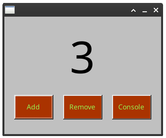

<p align="center">
    
</p>
<p align="center">
    
</p>

> [!IMPORTANT]  
> This project is very much in its infancy.  
> This README is half features in a workable state, and half wishful thinking.  
> This holds true for rest of the docs as well.

> [!WARNING]  
> Safety & Security policies have not been implemented or fully tested yet.
> Running untrusted XML files on VS can lead to [arbitrary code execution](./docs/users/safety-policies.md) on your machine with your user privileges.

Hey, you there! Yes you! May I entertain you with something slightly cursed?  
Have you ever woken up in the middle of the night, thinking:

> "Maaan, I'd really love to put a pinch of C, JS and WASM into my XML files and get a UI with vibes out of the 90's for my fancy codebase".

Well, you should eat lighter before nighttime.  
Still, it is your lucky day, & this project might be for you!

[![Building-Testing-badge]][Building-Testing-url]

## What is VS (naming review pending)

VS is a front-end framework based on the concept of composable SFCs (Single File Components).  
More specifically, VS is a runtime with very low resource requirements, that takes a dependency tree of XML SFCs, and renders it using a portable native toolkit library into a lightweight UI.  
Layout, style, data handling and embedded scripts are all part of these reusable components. They are embedded in the XML file pretty much as you would do with HTML.

VS is based on [FLTK](https://www.fltk.org/), a very lightweight and portable UI toolkit.  
Comparing its memory footprint with GTK or QT is not even fun.

## Example

The obligatory "counter" [example](./examples/demo-c.xml):  


```xml
<?xml version="1.0" encoding="UTF-8"?>
<app xmlns:fl="vs.fltk">
    <fl:window box="0,0,320,240" label="Demo Counter">
        <mixin name="+fl:button" bg.colour="#aa3300" label.colour="#99ee4f" />
        <script lang="c">
        <![CDATA[
        unsigned int counter = 0;

        void _update(){
            static char str_buf[32];
            itoa(counter,str_buf,10);
            $$prop($("main-text"),"label",str_buf);
        }

        void on_add(){
            counter++;
            _update();
        }

        void on_dec(){
            counter--;
            _update();
        }

        $cb(on_add);
        $cb(on_dec);
        ]]>
        </script>

        <fl:label name="main-text" label="0" label.size="90" box="20,20,280,120" />
        <fl:button label="Add" on.callback="on_add" box="20,160,80,50" />
        <fl:button label="Remove" on.callback="on_dec" box="120,160,80,50" />
        <fl:button label="Console" box="220,160,80,50">
            <script lang="c">
            <![CDATA[
            void callback(){
                $log(LOG_LOG,"Hello world!");
            }
            ]]>
            </script>
        </fl:button>
    </fl:window>
</app>
```

There is also a [js version](./examples/demo-js.xml) for reference.

## Why?

Because the current landscape of UI development kind of stinks. And to be totally honest, a lot of that smell comes from web technologies.  
We constructed layers over layers of complexity to wrap and bend HTML, to the point that its native UI components are not even used.  
And now we are required to waste at least 100MB of RAM just for the privilege of running webkit with an empty page.

It is sad to see that most of the modern native toolkits followed this same trend: QT & GTK both became a bloated mess over the last few years.  
For many desktop applications, any UI is just an overlay to give easy and intuitive access to the complex application below. And to make features discoverable. We don't need transparency, animations or a super complex logic to determine the state of a widget.  
And oftentimes, we want to run them on very low spec Linux system, without resorting to something as bare bone as [lvgl](https://lvgl.io/).

`vs` is an attempt to bring together the best of the techniques and patterns we learned in modern UI frameworks & web technologies onto a native runtime with a miniscule footprint.

Compared to other approaches, `vs` is extremely opinionated and tries to enforce just one way to make things right. It does not mean it is inflexible, just that it makes clear where complexity should be (spoiler, not in the UI). If you are coming from a less restrictive context you might find these limitations unpleasant at first, so I compiled a list of [frequently asked questions](./docs/faq.md) no one asked for, to make things easier.

## Planned Features

- [ ] FLTK UI widgets properly mapped into XML.
  - [ ] A set of better themes as default
  - [ ] A markdown component to render it directly (replacing the ancient HTML2.0 webview FLTK offers)
- [ ] A simple tree model to handle scope, events and queries
- [ ] An XML templating solution, baically a preprocessor like XSLT to compile _templates + static data_ down to components directly on client
- [ ] Native support for datasets & data models and their presentation layer
- [ ] Custom (application specific & sharable) components
  - [ ] XML custom components, capable of embedding any other type
  - [ ] Markdown-based custom components, capable of embedding `vs` code in place of HTML. Good for documentation
  - [ ] Native custom components, externally compiled from any language
  - [ ] WASM custom components, externally compiled from any language
  - [ ] A compiler to transform XML components directly into native code, so that they can run on natively, on WASM or in the riscv vm
- [ ] Embedded code inside XML components (like JS in HTML)
  - [ ] C as a scripting language, backed by [tinycc](https://github.com/KaruroChori/tcc-vs).
  - [ ] ~~Other derived alternatives, like [cello](https://libcello.org) or [vala](https://vala.dev/) would also be possible~~
  - [ ] JS powered by [QuickJS](https://github.com/quickjs-ng).
  - [ ] Lua, either based on its reference implementation or LuaJIT.
  - [ ] WASM to run any language which can be compiled to this target & their compilers
  - [ ] A RISCV virtual machine to run components from any language supporting this architecture
- [ ] Interoperability with external code:
  - [ ] Native interoperability with external dynamic libraries
  - [ ] Interoperability with arbitrary services/processes via unix domain sockets
- [ ] Distribution of components via http/https and [gemini](https://geminiprotocol.net/)
- [ ] A self-hosted visual editor to design, code and test new components (something like [gambas](https://gambas.sourceforge.net/en/main.html) or [fluid](https://www.fltk.org/doc-1.4/fluid.html))
- [ ] A robust permission system to decide what components can do based on their origin
- [ ] A target for single executables; compile your app down into one sharable file for systems onto which `vs` is not already distributed

You can read more about which features are planned in the [milestones page](./MILESTONES.md).

## Useful documentation

- Instuctions [for developers](./docs/developers/index.md)
- Instuctions (not yet) [for users](./docs/users/index.md) of vs
- Complete (not yet) [specifications](./docs/full-specs/index.md) for `vs`

## Licences

`vs` is copyrighted by [karurochari](https://github.com/KaruroChori) & [other contributors](https://github.com/KaruroChori/vs-fltk/graphs/contributors).  
Please, check the git history to track authorship.

Currently, most of this project is _source available_, under the terms of CC BY-ND. You can find out more in the [FAQ](./docs/faq.md).  
Still, any derivative work for private use, or for the sake of merging functionalities back to the main repository is allowed and encouraged.  
I am taking PR, but contributors should understand that the project is very early, and changes in its direction might waste their time.  
They should also be ok with their code being relicensed under more permissive terms later on, as this is the general intent behind the project once stable enough.

Still, some part of this repo are licenced separately:

- All `bindings` are CC0
- `examples` and `docs` are CC BY-SA
- Each of the subprojects imported clearly keeps its own licence and copyright notice.

Unless a file comes with a custom licence in its header, it will inherit the one of the closest parent folder.

## Dependencies

This project is based on the following dependencies:

### Core features

- [fltk](https://www.fltk.org/) the UI toolkit library used.
- [vs.templ](https://github.com/lazy-eggplant/vs.templ) a template engine for XML.
- [vs.yapm](https://github.com/lazy-eggplant/vs.yapm) yet another packet manager.
- [vs.xml-piler](https://github.com/lazy-eggplant/vs.xml-piler) to generate the XML parser backends based on schema files and specs.

### Infrastructure

- [pugixml](https://pugixml.org/) to parse XML.
- [sqlite](https://www.sqlite.org/) as the embedded DB to handle user profiles, caching etc.
- [mio](https://github.com/vimpunk/mio) memory mapping for loading files.
- [hashlib](https://github.com/lazy-eggplant/hash-library) for cryptographic functions (and not).
- [libuv](https://libuv.org/) for me not to care about portable code.
- [libffi](https://github.com/libffi/libffi) to simplify symbol sharing between languages.
- [libsodium](https://doc.libsodium.org/) for crypto stuff.

### For embedded scripts

- [tcc](https://github.com/lazy-eggplant/tcc-vs) the embeddable C compiler used for C scripts.
- [quickjs](https://github.com/quickjs-ng) the embeddable JS runtime used for JS scripts.
- [lua](https://www.lua.org/) and [luajit](http://luajit.org/) to support Lua scripts.
- [libriscv](https://github.com/libriscv/libriscv) the embeddable RISCV virtual machine, used for scripts, portable compiled components & toolchains.
- [wamr](https://github.com/bytecodealliance/wasm-micro-runtime) the embeddable WASM runtime used for scripts, portable compiled components & toolchains.

### For custom components

- [treesitter](https://tree-sitter.github.io/tree-sitter/) to handle parsing of languages (used for some components and the self-hosted editor).
- [md4c](https://github.com/mity/md4c) a library to parse markdown (not just to HTML).
- [nlohmann-json](https://github.com/nlohmann/json) to parse JSON in some `data` directives
- [vs.robot](https://github.com/lazy-eggplant/vs.robot) a library to perform automatic actions on FLTK.

[Building-Testing-badge]: https://github.com/KaruroChori/vs-fltk/actions/workflows/build.yml/badge.svg?branch=master
[Building-Testing-url]: https://github.com/KaruroChori/vs-fltk/actions/workflows/build.yml
