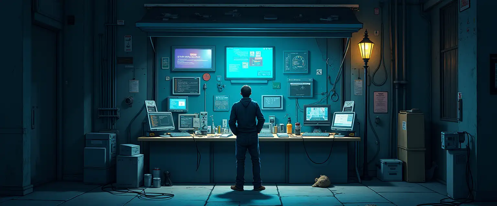

## General questions



While `vs` shares many of its technologies and ideas with modern SFC frameworks, its design is significantly more opinionated and less free.  
This document addresses several of the perceived or actual shortcomings, and provides some of the implied rationale.

### What is an SFC (Single File Component)?

SFCs are special files encapsulating templates, style and logic of a self-contained UI unit.  
They first appeared as part of long defunct proposal for native `html` components & XHTML XSLT components.  
They are now implemented in modern frameworks like [svelte](https://svelte.dev/) or [vue](https://vuejs.org/).

### Can we have something like `<canvas>`?

No. You are free to add or use a _custom native component_ if you really want. If you don't really need a full canvas, there is support still for arbitrary SVG files as part of `fltk`. But canvas-like components are not and **will never** be part of the core components shipped with `vs`. Because of that, such capabilities are not meant to be universally accessible by `vs` users.  
The reason is that canvas-like components can be abused to replace UI primitives, breaking the semantics on which accessibility tools and robots are relying upon. Furthermore, to be useful we should also allow arbitrary execution of code in embedded scripts that is generally discouraged even when enabled.

### Can we have a webgpu, opengl, vulkan context?

No, same as for `<canvas>`. But feel free to wrap a `vs` UI around a custom vulkan viewport if that fits you application.  
Be mindful you would need some way to distribute your custom software as it will not be working out of the box for most users.

### Why C in embedded scrips? It is unsafe!

Yes, you are basically giving all keys to the XML provider to run arbitrary code on your machine.  
Even if `vs` is not exposing direct access to the fs or network to embedded scripts, arbitrary C code, once compiled, will be able to do arbitrary things.  
It is understandable that from the point of view of "web development" this idea is absurd. But `vs` is not about web development, its main objective is to provide lightweight native UIs. You can load XML components and resources from the internet & gemini, but you should only accept native components and native scripts from trusted sources, quite possibly some you have control over.  
Still, that would be not less safe than just compiling and running some random code from github, but for some reason one is more socially accepted.

By comparison, QuickJS, Lua and especially WAMR do offer a much more sandboxed experience.  
In the future it will be possible to set up robust policies based on domains to determine which type of scripts should be allowed if any.  
For now, there are some coarse [environment variables](./env-vars.md) that can be set to fully disable certain features.

### Can it be used for fully standalone applications?

Ideally yes. Broadly speaking there are three "modes" in which `vs` can operate:

- As a fully standalone application. The main issue being the limited selection of functions which are made available in embedded scripts, and their sandboxed nature which only allows specific types of symbols to be exposed and shared.  
  Keep in mind that even while working in C, as unsafe as it is, you are not given direct full access to the standard library; this is deliberate design decision to limit the scope of custom code in scripts.
- As the front-end of a dynamically linked library which embeds all complex functionalities and provides hooks to the UI in `vs`. Events triggered from UI will trigger calls to features exposed in your library. Useful for event driven applications, like providing a simple visual front-end to your CLI.
- As the front-end of a separate process, sharing information via UNIX Domain Sockets. Useful for multi-client applications, or those in which the bulk of the operations are not event driven. It also avoids the need to compile your codebase into a dynamic library, allowing it to interoperate with virtually any runtime.

For now, most efforts are focused in making the first two options viable. The third one is planned for later.

### How to map SFC concepts to `vs`?

| Concept            | Web                                | VS                                  |
| ------------------ | ---------------------------------- | ----------------------------------- |
| Components         | XML or HTML template               | XML                                 |
| Static templating  | XSLT or JSX                        | vs-templ (XSLT-like)                |
| Dynamic templating | alpine, htmx, jquery, ...          | Restricted, via standard components |
| Style              | XSLT and/or CSS and transpilation  | Mixins                              |
| Scripting          | JS, WASM and transpilation         | C/JS/Lua/WASM                       |
| Data handling      | Limited via forms, JSON/XML via JS | Native `data` component             |

All flow control features and templating like `if` or `for-each` blocks which are typical in frameworks like [vue](https://vuejs.org/) are performed either:

- As a build step for components if they can be evaluated statically.
- Via custom elements and are not part of core `vs` and provide a controlled dynamic behaviour.

This comparison is just meant to provide some basic intuition of how things match.  
Still, the design patterns between `vs` and more traditional SFC frameworks are quite different.

### But I want a CSS-like experience!

In theory there is nothing preventing `vs` to integrate some `style` equivalent with mixins restructured as CSS-like classes.  
If you want to do that feel free to send in a PR, I am more than willing to see it integrated.

### Theming and colors schemes. What can I do?

FLTK, the toolkit on which `vs` is based, has limited capabilities in this respect.  
Out of the box, it makes opinionated choices on what and how to render boxes based on their class. Of those only few kinds are embedded in the engine.  
Hence, both indexed colors and box types have their semantics enforced by FLTK and are globally shared within each process.  
Given these constraints, one can specify any color or any rendering function for the different frame types (even SVG images). Yet it is not possible to introduce new classes out of thin air.

It is possible to define custom draw functions and adopt mixins to override the default style, but doing it more than occasionally would result in some quite messy code. If you need fine and frequent control over your UI, `vs` is likely not the right framework for you.

### Don't we have fluid already for FLTK?

[fluid](https://www.fltk.org/doc-1.4/fluid.html) is an excellent tool, but in my opinion it has few problems:

- The visual editor is nice, but it does not really allow defining custom widgets as standalone and reusable components. At least, not easily enough.
- It integrates C/C++ code only to "fill in" the missing parts of the application, in a way which I don't find particularly ergonomic.
- It does nothing to provide runtime capabilities for the UI beyond what FLTK offers, which is a bit too basic.
- It is restricted to C/C++, unless you linked your own dynamic library written with a language of choice.

### Is there any plan to support alternative backends to fltk?

Short answer, no. However, most of the infrastructure and code of this repo has only minimal reliance on fltk.  
It is possible for most code in this repo to be preserved if a new backend were to be selected.  
One scenario which might be interesting to consider is [lgvl](https://lvgl.io/) for example.

## Likely pitfalls

Unlike other runtimes adopting DOM-like structures, `vs` is not using XML nor its parsed version in memory as the actual UI representation.  
The XML source is statically compiled into a UI tree, a wrapper/superset of the tree structure that FLTK internally implements, enabling all the higher level features of `vs`.  
This means that at runtime the source XML will we de-allocated from memory right after the UI tree is built, and it cannot be trivially referenced again.  
We also plan in a not-so-far-distant future to use some source XML to generate the equivalent C++ code, and use that to reach a fully native level of performance and a minimal memory consumption.

### I want my todo list!

> How do I create a list which can spawn multiple copies of some component based on runtime data in XML then?

You don't. Components based on XML have several limitations on which mutations are allowed during runtime. A basic principle of this framework is to keep arbitrary code and logic as far away as possible from the final user, and what one sees in code should perfectly match what one visually gets. Making the tree mostly immutable and restricting which operations are allowed in the embedded scripts vibes with this vision of simplicity.  
In addition to XML components, native ones are also allowed in `vs`. Native components are written in C++ (or any language which can work with our C bindings) & built dynamically against the full library.  
Native components cover the same features provided by the XML builder and much more. There is (will be) a library of base native components designed to cover all common scenarios where dynamic data is expected to drive UI changes, but if yours does not fit you will have to write a custom one and ensure its semantics is explicitly encoded as meta-information.

Realistically, once `vs` gets stable enough, the standard library should be plenty for virtually any developer.
This way, any dynamic behaviour requiring arbitrary code execution is kept outside the XML tree, in a native codebase which is not controlled by any single developer (unless the final user decides to enable certain native components distributed by third parties). This fits with the design philosophy that there should only one good way to implement a certain feature on the UI front-end.

### What about templates?

> Ok, but being forced to manually write the code for 5x5 buttons on a widget is not really clever.

This is what build steps are for! You can generate your XML in [react](https://react.dev/) or [xslt](https://www.w3schools.com/xml/xsl_intro.asp) for example.  
We are also implementing our [own xml preprocessor](https://github.com/KaruroChori/vs-templ) to statically generate components within the `vs` viewer itself. Right now `vs.templ` is working in `vs`, but not every planned feature according to specs has been implemented yet.

### How to handle state & state changes?

> If the XML is lost, how to I know & query the state of widgets?

Not via a DOM structure. In theory FLTK provides an interface to get the current value of its properties from its own widgets, however we decided not to expose it fully.  
Still, `vs` widgets can provide some selected _computed properties_. It should be considered that props in the XML and keys used by FLTK are not a 1-to-1 match, even though we try to keep them as close as possible when reasonable; some complex processing on the input expressions can take place both at compile time and at runtime. None of that is directly reflected in the state of a FLTK widget.

Aside from these considerations, we can still keep state, just not explicitly within `vs` widgets.  
There are four main approaches, each suited best for a different class of cases.

#### Self mixins

Each `vs` widget with a frame can specify a self mixin, which internally is just a persisted map of props.  
Unlike props directly defined on the element itself, at runtime self mixins are persisted throughout the session.

Please, be mindful that self mixins will force widgets to have their own frame even if left nameless, significantly raising their memory footprint.  
Furthermore, mixins operate on objects serialized to strings, making the process of using them more computationally expensive.  
Still, this also makes them more flexible, as mixins represent expressions to compute and not immediate values.

I would like to close with an example showing a typical pitfall in handling state via mixins:

```xml
<component-a prop-1="value-1">
    <mixin prop-2="value-2">
</compoent-a>
```

`component-a` will be built with its own `prop-1` and `prop-2` inherited from the self mixin. However, the content of `prop-1` is applied & lost after compilation, while `prop-2` can be queried at runtime. Mixins can be mutated at runtime as well. ~~but an explicit update request must be triggered onto a component for it to be updated & reflect such changes.~~ nope, we set it dirty and recompute all dirty things after some time no more have been adeded

#### Data sources

Data sources can provide and store values for props.  
_Persistent storage_ and _Secrets_ are contextual data sources which are always implicitly made available and can be used with the same interface.

#### Within scripts

One should not be surprised that this approach is the least desirable. If you can do differently, please do.  
One can either have static variables in single users scripts, maps in modules, or have them linked from the back-end.

In any case, the mechanism to access these variables is via custom `setters` and `getters`.  
They will effectively appear as props and computed values of the widget they have been defined for and similarly accessed.

### What is mutable in a runtime instance?

- Viewports can be fully redrawn and re-sourced.
- Props of ui widgets can be freely changed. Exclusions apply to `name`, `frame.*` and few more which are reserved for internal use during the `ui-tree` construction.
- ~~Mixins can be added, removed or changed. Subtrees can be asked to recompute their style info after these changes.~~ (am I sure I want this?)

What is left out:

- You cannot re-render components imported and used or direct `use` as their slot designation is lost at runtime.
- Like all the other mutable pros, the `mixin` property of a widget can be changes and its previous state is not stored. So you cannot just append or remove parts from it, it must be fully overwritten each time.
- When you want a widget to be refreshed, its inline props cannot be evaluated again, as that is only available while parsing XML. If you want to avoid this pitfall, keep all of its style in external mixins, and just mutate its `mixin` list to set the desired visual state.

## Technical details

### How does the rendering work?

It is a process in two stages for each component:

- The first pass checks for all resources needed and scripts to compile. These sub-tasks are added to a pool and run in parallel. If cached, these results are retrieved. If cache-able, they are stored after computation.
- Once all resources for a component are resolved, the UI tree is constructed visiting the XML again with a depth-first pass.

At the end of this process the XML is freed.  
XML files are assumed to be fully loaded in memory during processing. However, it is possible to write a streaming parser with much lower memory footprint, as long as the XML is following the strict schema shipped with this repo (it has a rigid order for some tags).  
This strategy was not employed as it makes the loading process much slower for multithreaded systems with reasonable amounts of memory, and would only be better for low-end embedded systems where fltk is unlikely to be suitable.

## Licensing

### Can I contribute to this project?

Sure! Please be mindful of few things:

- Make sure you understand that this project uses different licenses for different parts.
- You should be ok with us including your contributions under those same terms.
- This project is very early, and your contribution might end up in the crossfire of roadmaps changing and goals shifting.
- If you want to contribute major features, I would _strongly_ recommend to reach out or to publish some form of written proposal.
- You should also accept that the CC Attribution–NoDerivs 4.0 covering most of the project will be relaxed at some point.
- You will be credited, at the very least by preserving the git history of the project.
- You are clearly able to distribute any standalone contribution you made as you wish. It is your code.

### What about those parts covered by the no-derivatives clauses?

Those clauses are just intended to protect this project in its early life, not to prevent people from contributing.  
If your plan is not to make your own fork and distribute an alternative version of `vs`, we are totally fine with that!

### Why this strange licence?

You are strange!  
Jokes aside, I _really_ don't want this project to be taken apart by sharks before it is able to run on its own legs.  
Or at the very least, I am trying to make it as hard as legally possible.

`vs` is extremely opinionated, and with opinions come division.  
XML or JSON, runtime DOM or not, and of course... data sources or arbitrary fetches in embedded scripts.  
My reluctance in adopting a less restrictive licence at this stage is well explained in the [gemini's faq](https://geminiprotocol.net/docs/faq.gmi).  
If I had to explain it more with my own words, let's think about a cost function describing the utility of frameworks like `vs`.  
There are many local minima in which such frameworks could end up stuck during development, be it as a necessary but temporary phase or as the unfortunate outcome of short-sighted design decisions.  
A good _vision_ is the only thing which allows a project to jump across, or at least get quickly out from the local minima of comfort-food.  
I am not saying my own is "right" nor immutable, just that I have few high-level objectives for this project that others might not share.  
Allowing `vs` to be freely forked at this stage comes with the very real risk of me being thrown in a competition I never asked for, unable to provide more than shallow promises on why my intention & my objectives would be "better".  
As I don't plan on making the development of this project a painful exercise in demagogy and convincing, I temporarily opted for a licencing model which prevents that.  
Once this project is robust enough to survive a hostile fork, I would be very glad to relicense it under permissive terms.

That being said, if you feel something in the direction of the project or the technical solutions proposed are not good, please reach out!  
I really appreciate any structured criticism, and I am grateful of any time others might want to put into that.  
I am not the kind of person which get stuck in their own positions just because they hold them at some point 😊.
